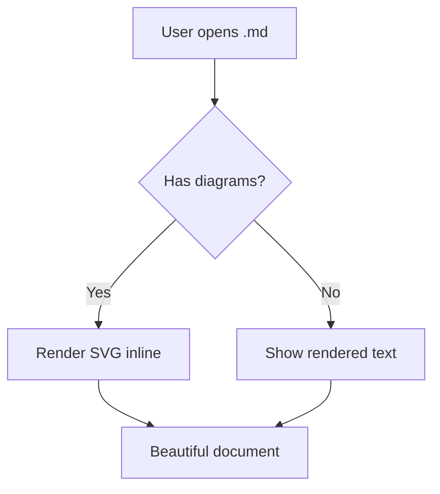
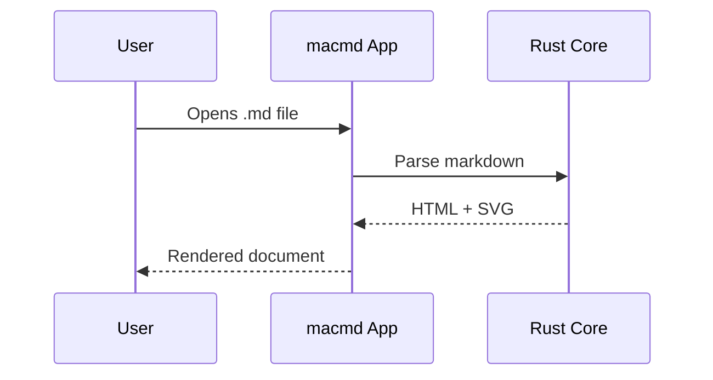

# Diagram & Math Demo

## Mermaid Flowchart

## Inline Math

The equation $E = mc^2$ shows energy-mass equivalence.

Euler's identity: $e^{i\pi} + 1 = 0$

## Display Math

$$\int_0^\infty e^{-x^2} dx = \frac{\sqrt{\pi}}{2}$$

## Mermaid Sequence Diagram

## Regular Text

This is just normal markdown with **bold** and *italic*.
